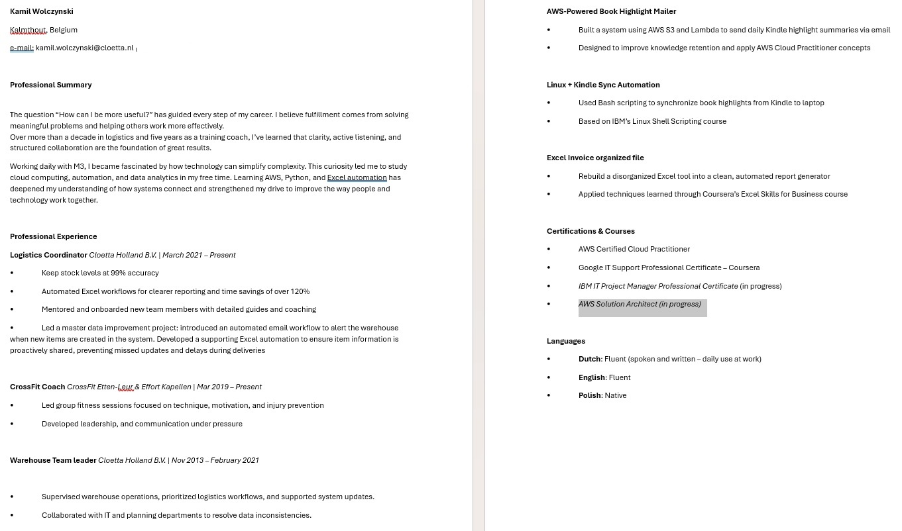
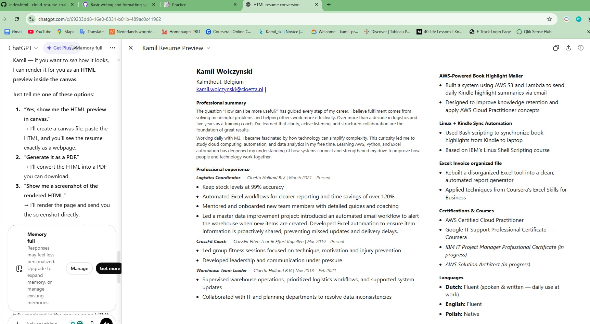

## Frontend Technical Specification

- Create a static website that serves an html resume.

## Resume Format Considerations

I'm going to use the Harvard Resume Template format as the basis of my resume.

I think about to be less structured and make my own format of resume.

### Resume for an internal interview


I'm going to let GerAI do the heavy lifting and generate out html and possibly CSS and from there I will manually refactor the code to preffered standard.
I will follow [Andre Brown teaching](https://app.exampro.co/student/material/crc-cpb-000/8518)

Prompt to ChatGPT:
```text
Convert this resume format to html.
Please don't use a css framework
Please use the least amount of css tags
```
This is my example


This is  which I will refactor.

This is what the generated HTML looks like unaltered:



### HTML Adjustments

- UTF8 supports most languages.
- Becauser I will be applying mobile styling to the website I'll include the viewport meta tag width=device-width so mobile styling scales normally.
- I'll extract me style into its own stylesheet after I am content with the HTML markup
- I'll simplfy the HTML markups css selector to be as minimal as possible.
- For teh HTML page I'll use soft tabs two spaces.

## Serve Static Wbsite Locally

I need to serve my static webpage locally so I can start using stylesheets externally from my HTML page in a Cloud Developer Environment (CDE)

> This is not necessary with local development

Assuming I have node install I'll use the simple web-server http-server

### Install HTTP Server
```sh
npm i http-server -g
```

https://www.npmjs.com/package/http-server/v/13.0.1

### Server Website

http-server will serve a public folder by default where the command is run.

```sh
cd frontend
http-server
```

## Image Size Consideration

I have backgriound texture that was 5.9MB
I'm going to optimize it to webpage with an online tool.


rgb(240,255,255); background